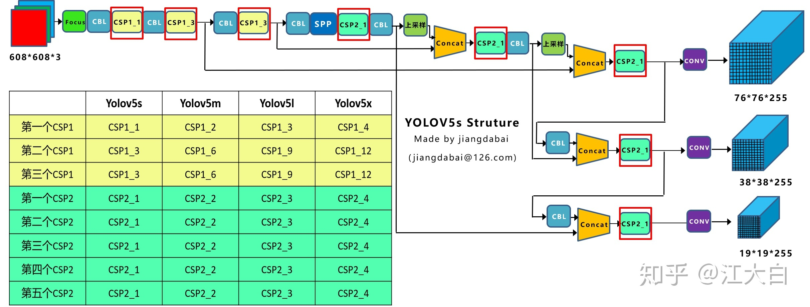
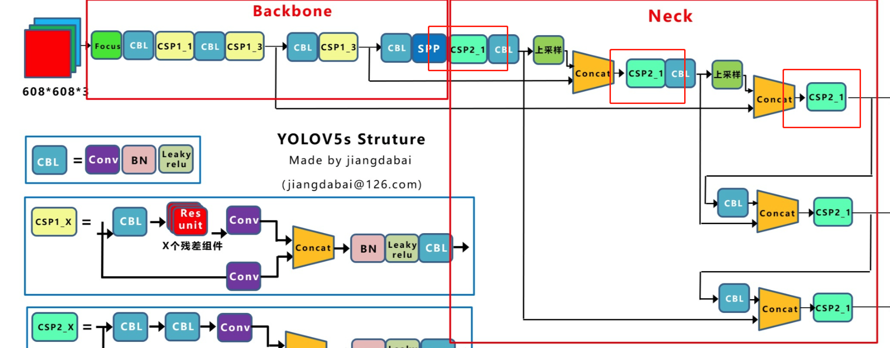

## YOLOV5

### 前言

YOLOV5的仓库：[YOLOV5仓库](https://github.com/ultralytics/yolov5)。YOLOV5版本有四种，分别为`YOLOV5-s`、`YOLOV5-m`、`YOLOV5-l`和`YOLOV5-x`。YOLOV5的算法性能如下：

Yolov5s网络最小，速度最少，AP精度也最低。但如果检测的以大目标为主，追求速度，倒也是个不错的选择。其他的三种网络，在此基础上，不断加深加宽网络，AP精度也不断提升，但速度的消耗也在不断增加。YOLOV5与前面YOLOV4等算法比较，有如下更新：

**（1）输入端：**Mosaic数据增强、自适应锚框计算、自适应图片缩放
**（2）Backbone：**Focus结构，CSP结构
**（3）Neck：**FPN+PAN结构
**（4）Prediction：**GIOU_Loss

### 网络结构

YOLOV5的网络结构与前者的YOLO算法类似，都包括输入端、骨干网络、Neck和Detector，但是也有一些大神认为yolov5将Neck和Detector融合在一个模块。

**（1）不同网络的深度**

需要注意的是，四种网络结构中每个CSP结构的深度都是不同的。

- 以yolov5s为例，第一个CSP1中，使用了1个残差组件，因此是**CSP1_1**。而在Yolov5m中，则增加了网络的深度，在第一个CSP1中，使用了2个残差组件，因此是**CSP1_2**。而Yolov5l中，同样的位置，则使用了**3个残差组件**，Yolov5x中，使用了**4个残差组件**。其余的第二个CSP1和第三个CSP1也是同样的原理。

- 在第二种CSP2结构中也是同样的方式，以第一个CSP2结构为例，Yolov5s组件中使用了2×X=2×1=2个卷积，因为Ｘ=1，所以使用了1组卷积，因此是**CSP2_1**。而Yolov5m中使用了2**组**，Yolov5l中使用了3**组**，Yolov5x中使用了4**组。**其他的四个CSP2结构，也是同理。

- Yolov5中，网络的不断加深，也在不断**增加网络特征提取**和**特征融合**的能力。

**（2）不同网络的宽度**

**（2）不同网络的宽度:**

如上图表格中所示，四种yolov5结构在不同阶段的卷积核的数量都是不一样的，因此也直接影响卷积后特征图的第三维度，即**厚度**，这里表示为网络的**宽度**。

- 以Yolov5s结构为例，第一个Focus结构中，最后卷积操作时，卷积核的数量是32个，因此经过**Focus结构**，特征图的大小变成**304\*304\*32**。而yolov5m的**Focus结构**中的卷积操作使用了48个卷积核，因此**Focus结构**后的特征图变成3**04\*304\*48**。yolov5l，yolov5x也是同样的原理。
- 第二个卷积操作时，yolov5s使用了64个卷积核，因此得到的特征图是**152\*152\*64**。而yolov5m使用96个特征图，因此得到的特征图是**152\*152\*96**。yolov5l，yolov5x也是同理。

#### 输入端

**（1）Mosaic数据增强**

Yolov5的输入端采用了和Yolov4一样的Mosaic数据增强的方式。

Mosaic数据增强提出的作者也是来自Yolov5团队的成员，不过，**随机缩放**、**随机裁剪**、**随机排布**的方式进行拼接，对于小目标的检测效果还是很不错的。

**（2） 自适应锚框计算**

在Yolo算法中，针对不同的数据集，都会有**初始设定长宽的锚框**。在网络训练中，网络在初始锚框的基础上输出预测框，进而和**真实框groundtruth**进行比对，计算两者差距，再反向更新，**迭代网络参数**。Yolov5中将自适应锚框嵌入到代码中，每次训练时，自适应的计算不同训练集中的最佳锚框值。当然，如果觉得计算的锚框效果不是很好，也可以在代码中将自动计算锚框功能**关闭**。

**（3）自适应图片缩放**

在常用的目标检测算法中，不同的图片长宽都不相同，因此常用的方式是将原始图片统一缩放到一个标准尺寸，再送入检测网络中。**Yolov5代码**中对此进行了改进，也是**Yolov5推理速度**能够很快的一个不错的trick。作者认为，在项目实际使用时，很多图片的长宽比不同，因此缩放填充后，两端的黑边大小都不同，而如果填充的比较多，则存在信息冗余，影响推理速度。因此在Yolov5的代码中datasets.py的letterbox函数中进行了修改，对原始图像**自适应的添加最少的黑边**。通过这种简单的改进，推理速度得到了37%的提升，可以说效果很明显。

#### Backbone

**（1）Focus结构**

以Yolov5s的结构为例，原始$608\times 608\times3$的图像输入Focus结构，采用切片操作，先变成$304\times304\times12$的特征图，再经过一次32个卷积核的卷积操作，最终变成$304\times304\times32$的特征图。**需要注意的是**：Yolov5s的Focus结构最后使用了32个卷积核，而其他三种结构，使用的数量有所增加，先注意下，后面会讲解到四种结构的不同点。**Focus模块**，**输入通道扩充了4倍**，**作用是可以使信息不丢失的情况下提高计算力**。具体操作为把一张图片每隔一个像素拿到一个值，类似于邻近下采样，这样我们就拿到了4张图，4张图片互补，长的差不多，但信息没有丢失，拼接起来相当于RGB模式下变为12个通道，通道多少对计算量影响不大，但图像缩小，大大减少了计算量。

**（2）CSP结构**

Yolov5与Yolov4不同点在于，Yolov4中只有主干网络使用了CSP结构。而Yolov5中设计了两种CSP结构，以**Yolov5s网络**为例，**CSP1_X结构**应用于**Backbone主干网络**，另一种**CSP2_X**结构则应用于**Neck**中。

#### Neck

**（1）PAN结构**

Yolov5现在的Neck和Yolov4中一样，都采用FPN+PAN的结构，但在Yolov5刚出来时，只使用了FPN结构，后面才增加了PAN结构，此外网络中其他部分也进行了调整。Yolov4的Neck结构中，采用的都是普通的卷积操作。而Yolov5的Neck结构中，采用借鉴CSPnet设计的CSP2结构，加强网络特征融合的能力。

**head部分没有任何改动**，和yolov3和yolov4完全相同，也是三个输出头，stride分别是8,16,32，大输出特征图检测小物体，小输出特征图检测大物体。

### 训练技巧

**（1）Bounding box损失函数**

Yolov5中采用其中的CIOU_Loss做Bounding box的损失函数。

**（2）nms非极大值抑制**

在目标检测的后处理过程中，针对很多目标框的筛选，通常需要nms操作。因为CIOU_Loss中包含影响因子v，涉及groudtruth的信息，而测试推理时，是没有groundtruth的。所以Yolov4在DIOU_Loss的基础上采用DIOU_nms的方式，而Yolov5中采用加权nms的方式。

**（3） Loss函数**

### 参考

1. [YOLOV5保姆级讲解](https://www.bilibili.com/video/BV1Dt4y1x7Fz/?spm_id_from=333.1007.top_right_bar_window_custom_collection.content.click)
2. [深入浅出Yolo系列之Yolov5核心基础知识完整讲解](https://zhuanlan.zhihu.com/p/172121380)

